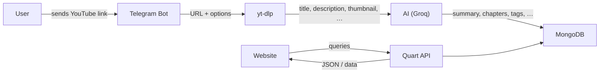

# hack-the-thread
by 180DC NITK

## Ideas / Stack
- Language -> Python
- Social Media Interface -> gallery-dl / yt-dlp
- Database -> Anything works, but mongo is the easiest
- ~~Whatsapp -> pywa (if i have time, i will do it with telegram too)~~
- AI -> Local LLM via LMStudio or Some AI/LLM with free API Keys and generous limit. using litellm as it supports converts  diff apis to the openai standart, which means that we can switch out the keys and we'll only have to change the model name.
- Website -> Tailwind, Brython.js (Python on the Web),
- Backend -> Quart (async reimplementation of flask)
- Telegram -> python-telegram-bot


## Readups / Resources
```
https://github.com/mikf/gallery-dl/issues/642
https://github.com/mikf/gallery-dl/issues/146
https://github.com/mikf/gallery-dl/issues/690
https://github.com/mikf/gallery-dl/issues/2956
https://github.com/mikf/gallery-dl/issues/4801
https://github.com/yt-dlp/yt-dlp
# https://pywa.readthedocs.io
https://github.com/python-telegram-bot/python-telegram-bot/
https://docs.python-telegram-bot.org/en/stable/
https://pymongo.readthedocs.io/en/stable/api/
https://github.com/BerriAI/litellm
https://docs.litellm.ai/docs/
https://gist.github.com/gruber/8891611 ## regex
https://docs.python-telegram-bot.org/en/stable/examples.echobot.html ## boilerplate
https://github.com/yt-dlp/yt-dlp/blob/master/yt_dlp/YoutubeDL.py
https://www.datacamp.com/tutorial/litellm
https://docs.litellm.ai/docs
https://stackoverflow.com/questions/14782894/run-a-python-program-on-a-new-thread
https://stackoverflow.com/questions/6893968/how-to-get-the-return-value-from-a-thread
https://www.geeksforgeeks.org/python/python-mongodb-query/
https://quart.palletsprojects.com/
```

## Logs
- Falling back to Telegram since i'm not comfortable providing my phone number to facebook which is required to create a developer account.
- yt-dlp is an easier option since it can be used as a python library, right away, gallery-dl was built as a command line tool and hence it is hard to use it as a library
or we can host / run a gallery dl server, and use that
Went with Google Gemini, for now


## challenges

- University and Workspace networks block communication on port 27017, figuring that out took a long time

## Data Flow Diagram 

